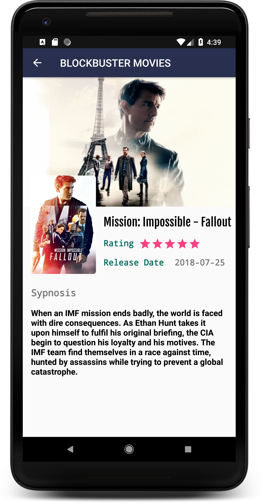

# Popular Movies

Here is a fully functional and colorful android app which I made from scratch for Android Developer Nanodegree program.
This app reveals the power of adaptive UI both for phone and tablet devices.

## Features

With the app, you can:
* Discover the most popular or most rated movies
* View movie details

## How to Work with the Source

This app uses [The Movie Database](https://www.themoviedb.org/documentation/api) API to retrieve movies.
You must provide your own API key in order to build the app. Generate you API_KEY and replace it in ApiClient.java class

## Screenshots

